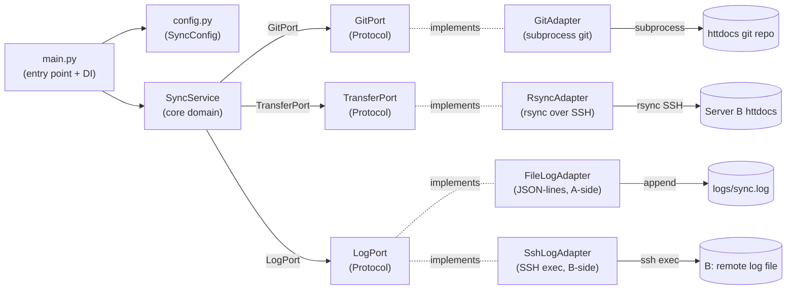

# feat: Server sync tool — hexagonal Python package with systemd timer

## Summary

Implement `hsm_sync` as a hexagonal-architecture Python package managed by `uv` and linted by `ruff`. On each cron tick the package commits httdocs state to git, logs the diff, and rsyncs the full tree (including deletions) to Server B over SSH. Deployed on Server A as a systemd timer unit — no Docker required. Core domain is isolated from subprocess/SSH via typed `Protocol` ports; adapters are injected at runtime, making the test suite fully mockable.

---

## Problem Frame

(see origin: `docs/brainstorms/2026-05-19-server-sync-tool-requirements.md`) Two legacy web servers need automated sync without CI/CD. This plan defines the implementation architecture for the tool described in the origin document.

---

## Requirements

**Git integration**
- R1. On each run, stage all httdocs changes (`git add -A`) and commit with a timestamp message.
- R2. Extract changed/added/renamed/deleted files from `git diff HEAD~1 HEAD --name-status` for logging.

**File transfer**
- R3. Transfer httdocs A→B using rsync over SSH with `--checksum` and `--delete`.
- R4. rsync target host, user, and path on B configurable via `.env`.
- R5. Files deleted on A deleted on B in the same sync run.
- R8. First run performs full checksum-based rsync; only actual diffs from B's current state sent.

**Logging**
- R6. A-side log: per-run JSON record — timestamp, changed files, rsync exit code, bytes transferred.
- R7. B-side log: per-run append via SSH exec — timestamp + receipt confirmation.
- R9. A-side log pruned each run; entries older than 7 days removed.
- R10. Log file path on A configurable via `.env`.

**Configuration**
- R11. All environment-specific values from `.env`; no hardcoded paths, credentials, or hostnames.
- R12. Script contains no hardcoded values.

**Testing**
- R13. Unit tests cover git ops, log writing/rotation, rsync command construction.
- R14. SSH and rsync calls are mockable; no real SSH or git needed to run tests.

**Origin actors:** A1 (Server A — primary), A2 (Server B — replica), A3 (Sync script), A4 (Operator)
**Origin flows:** F1 (Scheduled sync), F2 (First run / cold start)
**Origin acceptance examples:** AE1 (git commit + diff), AE2 (deletion propagation), AE3 (first run checksum), AE4 (log rotation), AE5 (test suite fully mocked)

---

## Scope Boundaries

- No CI/CD integration
- No bidirectional sync (B→A)
- No multi-replica (single B target) in v1
- No web dashboard or alerting; logs are plain files
- No automatic cron or systemd installation — operator deploys unit files manually
- `.git/`, `.env`, `.env.*`, `logs/`, `__pycache__/`, `*.pyc` excluded from rsync by default
- B does not need git installed
- No container image; systemd timer is the deployment target

### Deferred to Follow-Up Work

- Dry-run mode (`--dry-run` flag that skips rsync and B-side log): separate PR
- Multi-replica support: future iteration

---

## Context & Research

### Relevant Code and Patterns

- `.devcontainer/devcontainer.json` — Ubuntu base with `git`, `rsync`, `ssh`; Python 3 available via Ubuntu default; `uv` added at devcontainer post-create
- `.gitignore` — already covers `.env`, `logs/`, `.sync-state/`, `.bak`; `.hsm-sync-state` state file covered by existing ignore patterns
- `docs/plans/2026-05-19-001-feat-repo-init-devcontainer-gitignore-plan.md` — prior plan; devcontainer and `.gitignore` already complete

### Institutional Learnings

- None from `docs/solutions/` — greenfield tool

### External References

- uv docs: https://docs.astral.sh/uv/
- ruff docs: https://docs.astral.sh/ruff/
- `typing.Protocol` — stdlib, Python 3.8+; structural subtyping, no ABC overhead
- rsync `--stats` output: parse "Total transferred file size: N bytes" for bytes metric

---

## Key Technical Decisions

- **Hexagonal architecture with `typing.Protocol` ports**: core domain has zero subprocess or SSH imports; adapters implement ports structurally; tests inject mocks without patching internals
- **`uv` + `pyproject.toml`** (not `requirements.txt`): standard Astral project layout; `uv python install` handles Python 3.11 on legacy servers if needed
- **`ruff`** for lint + format in `pyproject.toml` `[tool.ruff]`; no separate `.ruff.toml`
- **Single rolling JSON-lines log on A** (not dated files): simpler to tail, parse, and prune; each line is one JSON object with a timestamp field
- **B-side log via SSH exec** (not SFTP): one subprocess call per run; no SFTP session or remote Python required
- **`--allow-empty` on git commit**: avoids error-handling for "nothing to commit"; diff returns empty list when no files changed; rsync still runs (idempotent)
- **rsync `--stats` flag**: parses "Total transferred file size: N bytes" from stdout for bytes metric
- **`.hsm-sync-state` file in deploy dir** (not in httdocs): stores last commit hash; absence = first run; loss = next run does safe full rsync
- **Systemd timer over cron**: journald logging, `Persistent=true` catches missed runs, no overlapping executions
- **`src/` layout with `uv`**: `src/hsm_sync` as importable package; `[project.scripts]` entry `hsm-sync = "hsm_sync.main:main"`
- **`BatchMode=yes` + `StrictHostKeyChecking=yes` on all SSH**: no interactive prompts in cron context; host must be in `known_hosts` before first run (documented setup step)

---

## Open Questions

### Resolved During Planning

- **Log rotation**: single rolling JSON-lines file, pruned by timestamp on each run — not dated log files
- **B-side log format**: single append file on B, path configurable via `.env`; written via SSH exec each run; no pruning on B
- **rsync excludes**: hardcoded defaults (`.git/`, `.env`, `.env.*`, `logs/`, `__pycache__/`, `*.pyc`) plus `RSYNC_EXCLUDES` env var for operator additions (comma-separated)
- **Deployment model**: systemd timer + uv; no container

### Resolved During Planning

- **rsync `--stats` parse failure**: treat missing or unparseable line as `bytes_transferred = 0`, no error — logged as 0 (sync correctness unaffected)

### Deferred to Implementation

- Exact `uv run` path for systemd `ExecStart` — resolved at deploy time based on `uv` install location

---

## Output Structure

    src/
      hsm_sync/
        __init__.py
        config.py
        main.py
        core/
          __init__.py
          models.py
          ports.py
          sync_service.py
        adapters/
          __init__.py
          git_adapter.py
          rsync_adapter.py
          file_log_adapter.py
          ssh_log_adapter.py
    tests/
      __init__.py
      unit/
        __init__.py
        test_sync_service.py
        test_git_adapter.py
        test_rsync_adapter.py
        test_log_adapters.py
        test_config.py
        test_end_to_end.py
    systemd/
      hsm-sync.service
      hsm-sync.timer
    pyproject.toml
    .env.example

---

## High-Level Technical Design

> *This illustrates the intended approach and is directional guidance for review, not implementation specification. The implementing agent should treat it as context, not code to reproduce.*

Data flow per sync run:

1. `main.py` loads config, checks `.hsm-sync-state` for first-run, wires adapters → `SyncService`
2. `SyncService.sync()`: `GitPort.commit()` → `GitPort.get_changed_files()` → `TransferPort.sync()` → `LogPort.write_entry()` on both A and B → `LogPort.prune_old_entries()` on A only
3. `main.py` writes current HEAD hash to `.hsm-sync-state` on success; exits non-zero on failure

---

## Implementation Units

- U1. **Project scaffold**

**Goal:** Establish package structure, `pyproject.toml` tooling config, and systemd unit templates

**Requirements:** R11, R12

**Dependencies:** None

**Files:**
- Create: `pyproject.toml`
- Create: `.env.example`
- Create: `src/hsm_sync/__init__.py`
- Create: `src/hsm_sync/core/__init__.py`
- Create: `src/hsm_sync/adapters/__init__.py`
- Create: `tests/__init__.py`
- Create: `tests/unit/__init__.py`
- Create: `systemd/hsm-sync.service`
- Create: `systemd/hsm-sync.timer`

**Approach:**
- `pyproject.toml`: `requires-python = ">=3.11"`; `dependencies = ["python-dotenv"]`; `[project.scripts]` entry `hsm-sync = "hsm_sync.main:main"`; `[dependency-groups]` dev = `["pytest", "pytest-cov"]`; `[tool.ruff]` with `line-length = 88`, `select = ["E", "F", "I", "UP"]`; `[tool.pytest.ini_options]` with `testpaths = ["tests"]`
- `.env.example`: all required vars with placeholder values and inline comments explaining each
- `systemd/hsm-sync.service`: `Type=oneshot`, `ExecStart=` placeholder, `User=` placeholder — no `EnvironmentFile=`; config is loaded by `load_dotenv()` in `main.py` so systemd does not need to parse the `.env` file (avoids format conflicts with quoted values and `export` statements)
- `systemd/hsm-sync.timer`: `OnCalendar=*:0/15` (every 15 min), `Persistent=true`, `WantedBy=timers.target`

**Test scenarios:**
Test expectation: none — pure scaffold with no behavioral code

**Verification:**
- `uv sync` installs deps without error
- `uv run ruff check src/` exits 0 on empty package stubs
- `uv run pytest` collects without import errors

---

- U2. **Core domain**

**Goal:** Define value objects, Protocol ports, and the central application service — no subprocess or SSH imports

**Requirements:** R1, R2, R3, R5, R6, R7, R9

**Dependencies:** U1

**Files:**
- Create: `src/hsm_sync/core/models.py`
- Create: `src/hsm_sync/core/ports.py`
- Create: `src/hsm_sync/core/sync_service.py`
- Test: `tests/unit/test_sync_service.py`

**Approach:**
- `models.py`: `@dataclass FileChange(path: str, status: str)` — status values M/A/D/R; `@dataclass SyncResult(changed_files: list[FileChange], rsync_exit_code: int, bytes_transferred: int, is_first_run: bool)`; `@dataclass LogEntry(timestamp: datetime, sync_result: SyncResult)`
- `ports.py`: three `typing.Protocol` classes — `GitPort` with `commit(message: str) -> None` and `get_changed_files() -> list[FileChange]`; `TransferPort` with `sync(is_first_run: bool) -> SyncResult`; `LogPort` with `write_entry(entry: LogEntry) -> None` and `prune_old_entries() -> None`
- `sync_service.py`: `SyncService(git: GitPort, transfer: TransferPort, a_log: LogPort, b_log: LogPort)` with `sync(is_first_run: bool) -> LogEntry` — commits, gets diff, syncs, writes both logs, prunes A log in that order

**Patterns to follow:**
- `typing.Protocol` (stdlib, Python 3.8+); `@dataclass(frozen=True)` for immutable value objects

**Test scenarios:**
- Happy path: `SyncService.sync(is_first_run=False)` calls `git.commit()`, `git.get_changed_files()`, `transfer.sync()`, `a_log.write_entry()`, `b_log.write_entry()`, `a_log.prune_old_entries()` — in that order
- Happy path: `sync(is_first_run=True)` passes `is_first_run=True` to `transfer.sync()`
- Happy path: returned `LogEntry` contains `SyncResult` from `transfer.sync()` with `changed_files` populated from `git.get_changed_files()`
- Error path: `transfer.sync()` raises `RuntimeError` → exception propagates; `a_log.write_entry()` is not called
- Integration: order of operations verified by asserting mock call sequence (git before transfer, both logs after transfer)

**Verification:**
- `uv run pytest tests/unit/test_sync_service.py` passes
- No import of `subprocess` or `paramiko` anywhere in `src/hsm_sync/core/`

---

- U3. **Git adapter**

**Goal:** Implement `GitPort` using subprocess git against the httdocs repo path

**Requirements:** R1, R2 (Covers AE1)

**Dependencies:** U2

**Files:**
- Create: `src/hsm_sync/adapters/git_adapter.py`
- Test: `tests/unit/test_git_adapter.py`

**Approach:**
- `GitAdapter(repo_path: Path)` implements `GitPort`
- `commit(message: str)`: `git -C repo_path add -A` then `git -C repo_path commit -m message --allow-empty`
- `get_changed_files() -> list[FileChange]`: first check commit count (`git -C repo_path rev-list --count HEAD`); if count == 1 (initial commit, no parent), return `[]` to skip diff; otherwise run `git -C repo_path diff HEAD~1 HEAD --name-status` and parse — for lines where the first tab-split field starts with `"R"` (rename), split into three fields (`R{score}\told\tnew`) and return `FileChange(path=new_path, status="R")`; for all other lines split on first tab into `(status, path)`
- All subprocess: `subprocess.run(..., capture_output=True, text=True, check=True)`

**Patterns to follow:**
- `subprocess.run` with `check=True` (raises `CalledProcessError` on failure — let it propagate)

**Test scenarios:**
- Happy path: diff output `"M\tindex.php\nA\tnewfile.js\nD\told.css"` → 3 `FileChange` objects with correct status and path (Covers AE1)
- Happy path: empty diff output → returns `[]`
- Edge case: rename line `"R100\told.php\tnew.php"` → `FileChange(path="new.php", status="R")`
- Edge case: repo has exactly one commit (no `HEAD~1`) → `get_changed_files()` returns `[]` without calling `git diff` (guard via `rev-list --count HEAD`)
- Edge case: `--allow-empty` commit on clean working tree → no error; subsequent `get_changed_files()` returns `[]`
- Error path: `repo_path` is not a git repo → `CalledProcessError` propagates unchanged
- Mock strategy: patch `subprocess.run` to return fake `CompletedProcess` with controlled stdout

**Verification:**
- `uv run pytest tests/unit/test_git_adapter.py` passes with no real git repo or filesystem access

---

- U4. **rsync adapter**

**Goal:** Implement `TransferPort` — build and execute the rsync command; return `SyncResult`

**Requirements:** R3, R4, R5, R8 (Covers AE2, AE3)

**Dependencies:** U2

**Files:**
- Create: `src/hsm_sync/adapters/rsync_adapter.py`
- Test: `tests/unit/test_rsync_adapter.py`

**Approach:**
- `RsyncAdapter(source_path: Path, remote_host: str, remote_user: str, remote_path: str, ssh_key_path: Path, extra_excludes: list[str] = [])` implements `TransferPort`
- Default excludes: `[".git/", ".env", ".env.*", "logs/", "__pycache__/", "*.pyc"]`
- Full command: `rsync -avz --checksum --delete --stats -e "ssh -i {key} -o BatchMode=yes -o StrictHostKeyChecking=yes" {--exclude=x ...} {source}/ {user}@{host}:{remote_path}/`
- Run with `subprocess.run(..., capture_output=True, text=True)` — no `check=True`; non-zero exit captured in result
- Parse "Total transferred file size: N bytes" from stdout; strip thousands-separator commas before converting to int (`"1,234,567 bytes"` → `1234567`); default to 0 if line absent (older rsync versions omit it)
- Return `SyncResult(changed_files=[], rsync_exit_code=proc.returncode, bytes_transferred=N, is_first_run=is_first_run)` — `changed_files` set by `SyncService` from git diff, not here

**Patterns to follow:**
- `subprocess.run` without `check=True` (non-zero exit is data, not an exception at this layer)

**Test scenarios:**
- Happy path: built command contains `--checksum`, `--delete`, `--stats` (Covers AE3)
- Happy path: SSH `-e` arg contains `-i {key_path}`, `BatchMode=yes`, `StrictHostKeyChecking=yes` 
- Happy path: all 6 default excludes present as `--exclude=...` args (Covers AE2 — `--delete` present)
- Happy path: `extra_excludes=["*.log", "*.bak"]` → both appended after defaults
- Happy path: stdout contains "Total transferred file size: 23456 bytes" → `bytes_transferred = 23456`
- Edge case: "Total transferred file size: 0 bytes" → `bytes_transferred = 0`
- Edge case: `--stats` line absent from stdout → `bytes_transferred = 0`, no error
- Edge case: rsync exits 23 (partial transfer) → `SyncResult.rsync_exit_code = 23`, no exception
- Mock strategy: patch `subprocess.run`; return fake `CompletedProcess` with controlled stdout and returncode

**Verification:**
- `uv run pytest tests/unit/test_rsync_adapter.py` passes with no real rsync binary

---

- U5. **Log adapters**

**Goal:** Implement `LogPort` for A-side (JSON-lines file with 7-day pruning) and B-side (SSH exec append)

**Requirements:** R6, R7, R9, R10 (Covers AE4)

**Dependencies:** U2

**Files:**
- Create: `src/hsm_sync/adapters/file_log_adapter.py`
- Create: `src/hsm_sync/adapters/ssh_log_adapter.py`
- Test: `tests/unit/test_log_adapters.py`

**Approach:**
- `FileLogAdapter(log_path: Path, retention_days: int = 7)` implements `LogPort`
  - `write_entry(entry)`: serialize `LogEntry` to JSON dict, append as newline; create parent dirs if absent
  - `prune_old_entries()`: read all lines, parse `timestamp` field as ISO datetime, drop lines where `now - timestamp > retention_days`; rewrite atomically (write `.tmp` sibling, `os.replace(tmp, final)`)
- `SshLogAdapter(host: str, user: str, key_path: Path, remote_log_path: str)` implements `LogPort`
  - `write_entry(entry)`: serialize `LogEntry` to JSON string; pipe it via stdin to avoid shell injection — `subprocess.run(["ssh", "-i", key, "-o", "BatchMode=yes", "-o", "StrictHostKeyChecking=yes", f"{user}@{host}", f"cat >> '{remote_log_path}'"], input=json_line + "\n", text=True)`; if SSH exits non-zero, log warning to stderr only — do not raise (B-side failure is non-fatal)
  - `prune_old_entries()`: no-op (B-side log not pruned by this tool)

**Patterns to follow:**
- Atomic file write: `os.replace(tmp_path, final_path)` — avoids truncated log on crash

**Test scenarios (FileLogAdapter):**
- Happy path: `write_entry()` appends valid JSON line; file contains one line per call; line is valid JSON
- Happy path: `write_entry()` on new file creates parent directories
- Happy path: `prune_old_entries()` with 3 recent + 2 entries from 8 days ago → 3 lines remain (Covers AE4)
- Edge case: `prune_old_entries()` on empty file → no error, file remains empty
- Edge case: `prune_old_entries()` on absent file → no error (treat as already empty)
- Edge case: atomic write — no `.tmp` sibling left after successful prune

**Test scenarios (SshLogAdapter):**
- Happy path: `write_entry()` calls `subprocess.run` with correct SSH command including `BatchMode=yes` and `StrictHostKeyChecking=yes`
- Happy path: SSH command appends to `remote_log_path` via `echo '...' >>`
- Error path: SSH subprocess exits non-zero → warning to stderr; no exception raised
- Edge case: `prune_old_entries()` → no subprocess call made (verified via mock assertion)
- Security: JSON content passed via `input=` (stdin), not interpolated into shell command — no injection risk from file paths or commit messages containing single quotes

**Verification:**
- `uv run pytest tests/unit/test_log_adapters.py` passes
- Atomic write confirmed: `.tmp` absent after successful prune in temp dir test

---

- U6. **Config and main entry point**

**Goal:** Load and validate `.env`; wire all adapters; detect first run; invoke `SyncService`; manage state file

**Requirements:** R11, R12 (ties R1–R10 together at runtime)

**Dependencies:** U2, U3, U4, U5

**Files:**
- Create: `src/hsm_sync/config.py`
- Create: `src/hsm_sync/main.py`
- Test: `tests/unit/test_config.py`

**Approach:**
- `config.py`: `load_config() -> SyncConfig`; calls `load_dotenv()`; reads env vars into `@dataclass SyncConfig`; missing required var raises `ValueError("Missing required env var: VAR_NAME")`
- Required vars: `HTTDOCS_PATH`, `REMOTE_HOST`, `REMOTE_USER`, `REMOTE_PATH`, `SSH_KEY_PATH`, `REMOTE_LOG_PATH`
- Optional vars: `LOCAL_LOG_PATH` (default `logs/sync.log`), `LOG_RETENTION_DAYS` (default `7`), `RSYNC_EXCLUDES` (default `""`, comma-split), `STATE_FILE_PATH` (default `{script_dir}/.hsm-sync-state`)
- `main.py`:
  1. Load config
  2. Resolve state file path from `STATE_FILE_PATH` env var (configurable); default to `.hsm-sync-state` adjacent to `LOCAL_LOG_PATH`'s parent dir — never use `__file__` (resolves into site-packages under uv)
  3. First-run detection: state file absent or empty → `is_first_run = True`; else read last commit hash (informational; used to confirm prior run succeeded)
  4. Instantiate `GitAdapter`, `RsyncAdapter`, `FileLogAdapter`, `SshLogAdapter`
  5. Instantiate `SyncService`
  6. Call `service.sync(is_first_run)` — propagate exceptions
  7. On success: write current HEAD hash to state file; `sys.exit(0)`
  8. On unhandled exception: log to stderr; `sys.exit(1)`

**Test scenarios (config):**
- Happy path: all required vars set → `SyncConfig` populated with correct types and values
- Error path: `REMOTE_HOST` absent → `ValueError("Missing required env var: REMOTE_HOST")`
- Happy path: `LOG_RETENTION_DAYS` absent → `SyncConfig.log_retention_days == 7`
- Happy path: `RSYNC_EXCLUDES="*.log,*.bak"` → `["*.log", "*.bak"]`
- Edge case: `RSYNC_EXCLUDES=""` → `[]` (no extra excludes)
- Edge case: `SSH_KEY_PATH` set to non-existent path → config loads without error (file existence validated at runtime by SSH)

**Verification:**
- `uv run pytest tests/unit/test_config.py` passes
- `uv run hsm-sync` with valid `.env` completes without import error (smoke test, real servers not needed)

---

- U7. **End-to-end test with mock adapters**

**Goal:** Confirm full sync workflow wiring with all adapters mocked; zero real subprocess or SSH calls (Covers AE5)

**Requirements:** R13, R14 (Covers AE5)

**Dependencies:** U2, U3, U4, U5, U6

**Files:**
- Create: `tests/unit/test_end_to_end.py`

**Execution note:** Write mock adapter classes first, then wire through `SyncService` — validates the integration contract before U6 wiring is finalized.

**Approach:**
- Define `MockGitAdapter`, `MockTransferAdapter`, `MockLogAdapter` classes implementing the three Protocols; use `unittest.mock.MagicMock` or hand-written simple mocks
- Instantiate `SyncService` with mocks directly (no `main.py`); call `sync(is_first_run=False)` and `sync(is_first_run=True)`
- Assert call sequences and `LogEntry` shape

**Test scenarios:**
- Happy path: full end-to-end run with all mock adapters — zero real subprocess calls made; `LogEntry` returned (Covers AE5)
- Happy path: all six mock methods called in correct order: `git.commit` → `git.get_changed_files` → `transfer.sync` → `a_log.write_entry` → `b_log.write_entry` → `a_log.prune_old_entries`
- Happy path: `b_log.prune_old_entries()` is never called (B-side log not pruned by `SyncService`)
- Happy path: `is_first_run=True` → `MockTransferAdapter.sync()` receives `is_first_run=True`
- Happy path: `LogEntry.sync_result.changed_files` matches what `MockGitAdapter.get_changed_files()` returned
- Error path: `MockTransferAdapter.sync()` raises `RuntimeError` → `SyncService.sync()` propagates; `MockLogAdapter.write_entry()` never called
- Edge case: `MockGitAdapter.get_changed_files()` returns `[]` (no changes) → sync still runs; `LogEntry.sync_result.changed_files` is `[]`

**Verification:**
- `uv run pytest tests/unit/test_end_to_end.py -v` passes with zero real subprocess calls
- `uv run pytest` (full suite) exits 0

---

## System-Wide Impact

- **Interaction graph:** systemd timer → `hsm-sync` entry point → `main.py`; no other entry points; no inbound network
- **Error propagation:** unhandled exceptions in `SyncService` propagate to `main.py` → `sys.exit(1)`; systemd records exit code in journald; `SshLogAdapter.write_entry()` is the only intentionally swallowed error (non-fatal; B-side log failure does not abort the sync)
- **State lifecycle risks:** `.hsm-sync-state` written only on success; a failed run leaves last-known-good hash in place; corruption or deletion is safe — next run treats as first run and does full rsync
- **API surface parity:** no external API; tool is a standalone CLI executed by systemd
- **Integration coverage:** U7 end-to-end test covers full service wiring with mocks; real rsync + SSH integration is an operator verification step at deploy time
- **Unchanged invariants:** httdocs git repo on A continues working normally; sync tool is an additive git author (creates commits) but does not manage branches, remotes, or config

---

## Risks & Dependencies

| Risk | Mitigation |
|------|------------|
| A→B SSH not yet tested | Operator verifies `ssh -i $SSH_KEY_PATH $REMOTE_USER@$REMOTE_HOST echo ok` before first deploy |
| rsync `--checksum` slow on large trees | Acceptable for legacy codebase size; operator adds `RSYNC_EXCLUDES` to skip binary assets if needed |
| `StrictHostKeyChecking=yes` blocks first run if B not in known_hosts | Document `ssh-keyscan $REMOTE_HOST >> ~/.ssh/known_hosts` as required setup step |
| systemd not available on Server A | Fall back: `*/15 * * * * cd /path/hsm-sync && uv run hsm-sync >> /var/log/hsm-sync.log 2>&1` |
| Python 3.11 not on Server A | `uv python install 3.11` at setup time; uv manages its own Python hermetically |
| `.hsm-sync-state` corrupted or deleted | Safe: next run is a full checksum rsync — idempotent |
| rsync `--delete` removes unexpected files on B | First-run dry-run verification recommended (see Deferred to Follow-Up Work) |

---

## Documentation / Operational Notes

Operator setup checklist (document in README):

1. `curl -LsSf https://astral.sh/uv/install.sh | sh` on Server A
2. Clone this repo to `~/hsm-sync/` on Server A (separate from httdocs)
3. `cp .env.example .env` and fill in all values
4. `ssh-keyscan $REMOTE_HOST >> ~/.ssh/known_hosts`
5. `ssh -i $SSH_KEY_PATH $REMOTE_USER@$REMOTE_HOST echo ok` — verify A→B SSH works
6. `uv sync` — install deps
7. `uv run hsm-sync` — test run, verify logs appear on both servers
8. Copy `systemd/hsm-sync.{service,timer}` to `/etc/systemd/system/`; edit `ExecStart` and `EnvironmentFile` paths
9. `systemctl enable --now hsm-sync.timer`
10. `systemctl list-timers hsm-sync.timer` — confirm timer scheduled

---

## Sources & References

- **Origin document:** [docs/brainstorms/2026-05-19-server-sync-tool-requirements.md](docs/brainstorms/2026-05-19-server-sync-tool-requirements.md)
- Prior plan: [docs/plans/2026-05-19-001-feat-repo-init-devcontainer-gitignore-plan.md](docs/plans/2026-05-19-001-feat-repo-init-devcontainer-gitignore-plan.md)
- uv docs: https://docs.astral.sh/uv/
- ruff docs: https://docs.astral.sh/ruff/
